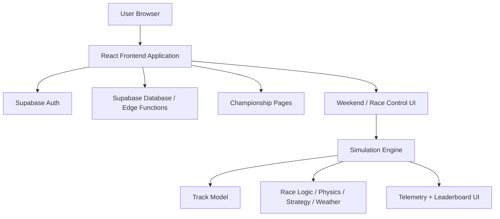

# Technical Architecture

## 1. System Overview

Box This Lap is structured as an online championship application with a browser-based simulation subsystem.
The current app shell is built around Supabase-authenticated routes, championship/weekend management pages, and race-control views that run the local simulation engine against online championship context.

At a high level, the system has three layers:

1. **Frontend application**
   - React + Vite SPA
   - authenticated app shell and route handling
   - page-level flows for championships, weekends, team management, facilities, research, and race control

2. **Backend integration layer**
   - Supabase auth/session management
   - database-backed championship, weekend, team, and progression data
   - API/helper layer for app-to-backend communication

3. **Simulation subsystem**
   - local browser simulation engine for race execution
   - track, weather, tyre, strategy, and race-logic systems
   - UI surfaces for telemetry, leaderboard, and strategy interaction

## 2. Technology Summary

- Frontend: React 18 + TypeScript + Vite
- Styling: Tailwind CSS
- State management: Zustand + React hooks
- Charts/UI telemetry: Recharts
- Backend: Supabase auth + data/services
- Simulation runtime: browser-based engine invoked by race-control flows

## 3. Routing Model

The active route model is defined in `src/App.tsx`.

### Public routes

| Route | Purpose |
|-------|---------|
| `/login` | User authentication |
| `/race-dev` | Local/dev race control shell |
| `/practice-quali-dev` | Development route for session experiments |
| `/career` | Legacy local championship prototype |
| `/offline` | Legacy offline championship shell |
| `/offline/weekend` | Legacy offline weekend shell |

### Protected application routes

All routes under the authenticated app shell are guarded by `ProtectedRoute` in `src/App.tsx`.

| Route | Purpose |
|-------|---------|
| `/` | Dashboard |
| `/championships` | Championship list |
| `/championships/:id/select-team` | Team selection |
| `/championships/:id` | Championship details |
| `/weekends/:id` | Weekend details |
| `/race/:weekendId` | Online race control |
| `/team-hub` | Team hub |
| `/research` | Research and development |
| `/facilities` | Facilities management |
| `/settings` | Settings |

## 4. Authentication and Session Model

The app uses Supabase session state as the entry gate for the main product flow.

- `src/App.tsx` calls `supabase.auth.getSession()` on load.
- `ProtectedRoute` subscribes to `supabase.auth.onAuthStateChange(...)`.
- Unauthenticated users are redirected to `/login`.
- Authenticated users enter the main application shell via `src/components/Layout.tsx`.

This makes online championship management the primary operating model for the app.

## 5. Core Application Areas

### 5.1 Championship and weekend management

Primary pages include:
- `src/pages/Dashboard.tsx`
- `src/pages/Championships.tsx`
- `src/pages/ChampionshipDetails.tsx`
- `src/pages/WeekendDetails.tsx`
- `src/pages/TeamSelection.tsx`
- `src/pages/TeamHub.tsx`
- `src/pages/Facilities.tsx`
- `src/pages/ResearchDevelopment.tsx`

These routes represent the main online championship flow and should be treated as the canonical product path in documentation.

### 5.2 Race execution

`src/pages/RaceControl.tsx` is the race/session runner UI.
It is used both by the online weekend flow (`/race/:weekendId`) and by development/local routes that still exist for testing and iteration.

### 5.3 Simulation engine

The simulation engine remains a core subsystem rather than the full product architecture.
Key areas include:
- `src/engine/simulation.ts`
- `src/engine/systems/PhysicsSystem.ts`
- `src/engine/systems/RaceLogicSystem.ts`
- `src/engine/systems/StrategySystem.ts`
- `src/engine/systems/WeatherSystem.ts`
- `src/store/raceStore.ts`

## 6. Documentation Direction

The canonical championship direction for this repository is **online/Supabase-backed**.
Offline/local championship planning documents may still exist in `docs/`, but they should be treated as historical or legacy planning material rather than the active architecture target.
