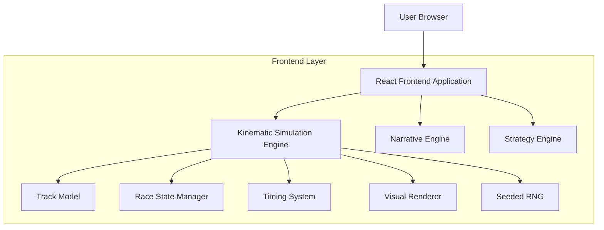

## 1. Architecture design



## 2. Technology Description

- Frontend: React@18 + TypeScript + Vite
- Initialization Tool: vite-init
- Backend: None (client-side simulation)
- State Management: React Context + Custom Hooks
- Animation: CSS Transitions + requestAnimationFrame

## 3. Route definitions

| Route | Purpose |
|-------|---------|
| / | Main race view with live simulation |
| /setup | Pre-race configuration and track selection |
| /strategy | Strategy planning interface |

## 4. Core Type Definitions

### 4.1 Track Model

```typescript
interface TrackSector {
  id: string;
  startDistance: number;
  endDistance: number;
  isPassZone: boolean;
  difficulty: number;
}

interface Track {
  id: string;
  name: string;
  totalDistance: number;
  sectors: TrackSector[];
  pitLane: {
    entryDistance: number;
    exitDistance: number;
    speedLimit: number;
    stopTime: number;
  };
}
```

### 4.2 Vehicle Kinematics

```typescript
interface VehicleState {
  id: string;
  driverName: string;
  team: string;
  distanceOnLap: number;
  totalDistance: number;
  speed: number;
  acceleration: number;
  lapCount: number;
  currentSector: number;
  isInPit: boolean;
  pitStopCount: number;
}

interface SpeedFactors {
  baseSpeed: number;
  strategicMultiplier: number;
  conditionMultiplier: number;
  randomNoise: number;
}
```

### 4.3 Timing Data

```typescript
interface SectorTime {
  sectorId: string;
  time: number;
  isPersonalBest: boolean;
  isOverallBest: boolean;
}

interface LapTime {
  lapNumber: number;
  totalTime: number;
